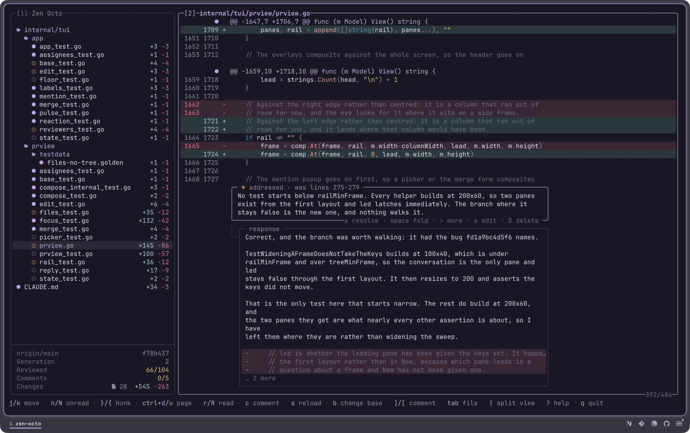
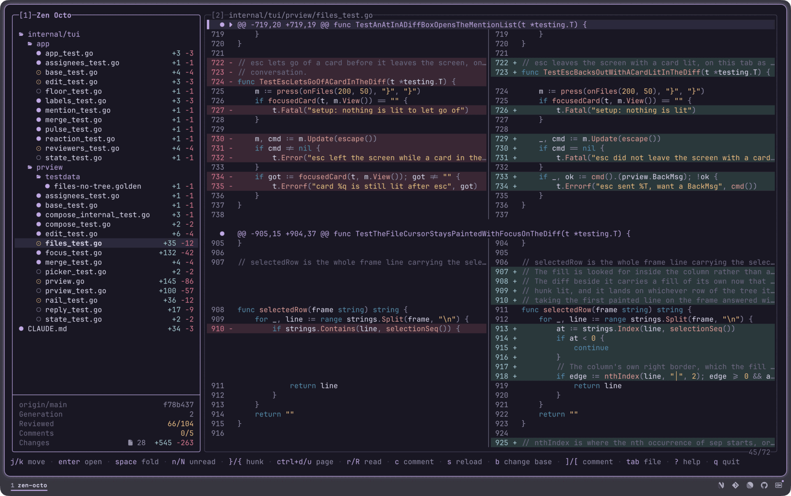

# zen-review

A terminal code reviewer that keeps track of what you have read, for people
reviewing changesets an agent wrote.

Agents write code faster than you can read it, and they rewrite code you have
already read. zen-review stores what you have read as line ranges against the
code itself, and carries those ranges through each new version of the
changeset. A range that survives moves with its code. A range the rewrite
destroyed comes back unread, and the file says it changed after you reviewed it.

The ranges travel through a git diff of two committed snapshots. Each generation
of the changeset is a real commit under `refs/zen-review/sessions/<id>`, so a
rename, a base that moved, or a force-push that lost the fork point is answered
by asking git where the lines went. Where git cannot answer, zen-review takes
the lines back rather than guessing, because guessing they stayed put is how a
review reports code nobody read as read.

The unit is a line range, so rewriting five lines of a forty-line hunk returns
five lines unread and leaves the other thirty-five read.

This is v0.1.0, an early release ahead of a launch.



A real session against another repo: 28 files, 66 of 104 hunks read, five
comments on it and none resolved yet. The tree marks what has been read and what
has not.

The card under the diff is a comment somebody answered. Hanging off it on a rail
is the response, and under the words are the lines that response replaced. That
block is the point: the state claims the work was done, and the code is what you
confirm the claim against.

The bar down the left of the cursor's row is where the next key acts. `n` walks
to the next unreviewed hunk, `r` marks the one you are on and advances, and the
count in the corner is what you are burning down.



`|` puts the two sides in two columns. A run of removals pairs against the run
of additions after it, one row each, and the shorter side draws a blank rather
than shifting up. The cursor lives in one column and only that column lights,
so a comment written here is scoped to the side you are reading.

Every question the reader answers, the CLI answers with no terminal attached:

```
base        main (fc8b758)  ·  no remote
generation  1
session     refs/zen-review/sessions/5817549abf0a013f

M  main.go  reviewed    1 of 1  +2 -1
     head  7  reviewed
M  sum.go   unreviewed  0 of 1  +10 -3
     head  4  unreviewed

2 files, 1 of 2 reviewed
```

Bare `zen-review` opens one changeset: the merge base with the base branch,
through the working tree, untracked files included. It takes no flag to narrow
that, so what you are reviewing is the same thing on each run and every stored
range measures against it.

Two other terminal reviewers cover ground this one does not, and
[Acknowledgments](#acknowledgments) says which one to reach for.

## Install

```sh
curl -fsSL https://raw.githubusercontent.com/praxis-labs-io/zen-review/main/install.sh | sh
```

Downloads the binary for macOS or Linux, on arm64 or amd64. Windows takes the
`.zip` off the
[releases page](https://github.com/praxis-labs-io/zen-review/releases), the
installer being a POSIX script. On anything else:

```sh
go install github.com/praxis-labs-io/zen-review/cmd/zen-review@latest
```

Or from a clone, which is what you want if you intend to change anything:

```sh
git clone https://github.com/praxis-labs-io/zen-review.git
cd zen-review
make install
```

The installer and `make install` both put the binary in `~/.local/bin`, and
`INSTALL_DIR` moves it. `go install` writes to `$(go env GOPATH)/bin` and takes
neither. [docs/install.md](docs/install.md) has the requirements, the PATH setup
and how to upgrade.

## A first review

```sh
cd your-repo
zen-review
```

It measures against your base branch, builds a snapshot of the changeset, and
opens on the first hunk you have not read.

`n` is the key that matters. A review is a burn-down and `n` walks to the next
unreviewed hunk. `r` marks the one you are on and advances, so `r r r r` walks
the whole thing. `c` writes a comment, `|` splits the diff into two columns, and
`?` lists every key.

Come back tomorrow and it is where you left it. Let an agent rewrite half of it
first and the review is still where you left it, minus the parts that moved.

## Reviewing what an agent wrote

This is the loop the tool exists for. You read, the agent answers, and the
engine keeps track of what that answer moved.

**Read it and say what is wrong.** `c` on a hunk, or from a script:

```sh
zen-review comment internal/app/image.go --hunk 112 \
  --body "This slices runes where the value counts cells."
```

**Hand the queue to the agent.**

```sh
zen-review comments --state open --json
```

Each comment comes back with its id, its file, the side and lines it is anchored
to, and the body. The agent fixes what it can and says so:

```sh
zen-review address 2a8359b42163 --body "Switched it to lipgloss.Width."
```

`address` is the agent's verb. It records that the work was done and it does
**not** close the comment, because the claim and the confirmation are different
facts. Closing is yours.

**Gate the agent on the queue.** Three exit codes, so a hook can tell a queue
from a failure:

```sh
zen-review comments --state unresolved --exit-code
```

`0` nothing open, `1` work waiting, `2` the call failed. A Stop hook reading only
non-zero cannot tell an open comment from a broken git call, and blocks forever
on the second.

**Then look at what changed.** `s` rebuilds the changeset. Every reviewed range
is translated through a diff of the two snapshots: a range that survives moves
with its code, and a range the rewrite destroyed comes back unread with the file
marked `changed after review`. Comments travel the same way. A comment whose
code is gone is orphaned, and it stays on screen in that state.

An answered comment then draws the code its answer replaced, which is the first
screenshot above. The state claims the work was done; the block is what you
check the claim against without re-reading the file.

[Agents](docs/agents.md) has the whole loop, the JSON shape, and the hook config.

## Documentation

- [Guide](docs/guide.md): the base, sessions and generations, what survives a
  rewrite, how comments travel
- [CLI reference](docs/cli.md): every command, flag and exit code
- [Keys](docs/keys.md): the keymap and what each key does
- [Install](docs/install.md): requirements, PATH, upgrading
- [Agents](docs/agents.md): driving the tool from a hook or a script
- [Contributing](docs/CONTRIBUTING.md): building, testing and the layer
  boundaries

## Acknowledgments

zen-review was written after living in two tools we admire, and it took ideas
from both.

[hunk](https://github.com/modem-dev/hunk), by
[Ben Vinegar](https://github.com/benvinegar) at
[Modem](https://github.com/modem-dev), presents a large changeset better than
anything else in a terminal: one continuous multi-file stream with a sidebar,
split and stacked layouts that follow the width, full mouse support, and a watch
mode that reloads while the agent is still writing. It reads git, jujutsu and
Sapling with native revsets, installs as your pager or difftool so `git diff`
opens it, and draws an agent's annotations beside the code they explain. Reach
for hunk when you want the changeset rendered as well as a terminal can render
it, or when you are on jujutsu or Sapling.

[tuicr](https://github.com/agavra/tuicr), by
[Almog Gavra](https://github.com/agavra), modelled code review in a terminal
rather than diff viewing, and got there first. It opens uncommitted work, a
commit range, or a remote pull request by number across GitHub, GitLab and
Bitbucket, over git, jj and mercurial. It carries a complete vim model down to
visual-mode range comments and a `:` prompt, and `:submit` posts a real review
with the inline comments landing on the right lines. It tracks what you have
reviewed and keys that state on content rather than position, so an edit above a
hunk leaves the hunk marked. zen-review's `r` and its burn-down came from tuicr.
Reach for tuicr when the review has to land on a pull request, because
zen-review has no forge integration.

Both are configurable in ways zen-review is not: config files and remappable
keys, against a theme that follows your terminal without being asked and a fixed
keymap.

Neither project shares code with zen-review. The debt is to their ideas.

Drawn in your terminal's own colours. Rendered by
[Bubble Tea](https://github.com/charmbracelet/bubbletea) and
[Lip Gloss](https://github.com/charmbracelet/lipgloss), highlighted by
[Chroma](https://github.com/alecthomas/chroma).

## License

MIT. See [LICENSE](LICENSE).
